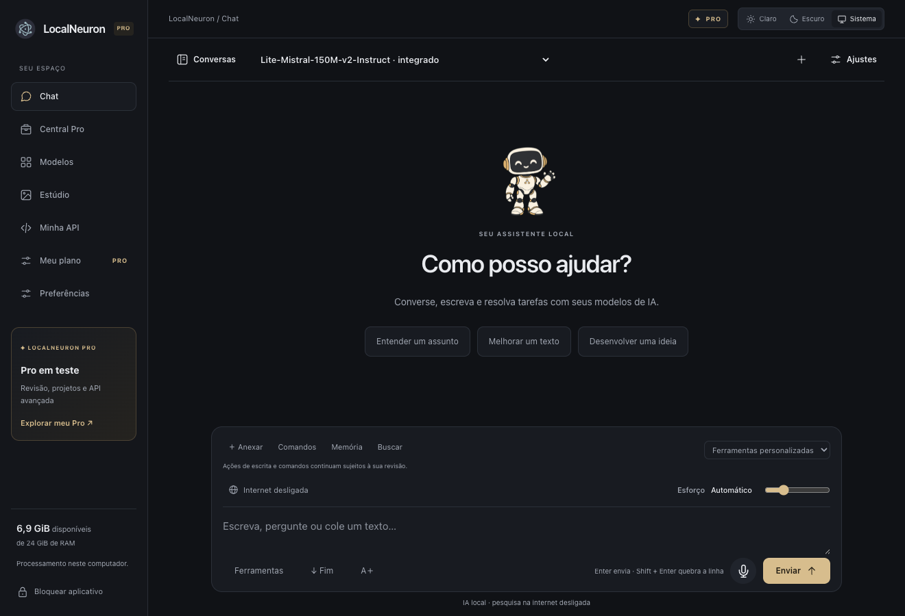

<p align="center"></p>
<h1 align="center">LocalNeuron</h1>
<p align="center"><strong>Sua IA. Seu computador.</strong><br>Baixe modelos, converse, crie e conecte ferramentas em um espaço local.</p>
<p align="center"><a href="https://Arthur06311.github.io/localneuron/">Site público</a> · <a href="https://Arthur06311.github.io/localneuron/guide.html">Guia de configuração</a> · <a href="https://github.com/Arthur06311/localneuron/releases">Downloads</a> · <a href="https://github.com/Arthur06311/localneuron/issues">Reportar problema</a></p>



*Interface 0.26 em espaço de demonstração. A ativação Pro de teste mostrada não acompanha os pacotes públicos.*

**Alfa 0.27.0.** Aplicativo desktop para usar modelos de IA no próprio computador, com motores independentes de LM Studio. A instalação de modelos precisa de internet; depois de preparados, os motores compatíveis fazem inferência local e offline. Pesquisar na web e usar serviços conectados exige rede.

Veja as [novidades da 0.27](docs/localneuron-0.27.md): acesso lembrado opcional, wizard persistente, equipes em um clique, tarefas por especialista e avisos de atualização.

## Download e primeiros passos

Baixe os instaladores na página de [versões](https://github.com/Arthur06311/localneuron/releases). Os arquivos ZIP/TAR de **Source code** do GitHub são código-fonte, não o aplicativo instalado.

| Sistema | Arquivo | Estado da validação |
|---|---|---|
| macOS Apple Silicon | `LocalNeuron-macOS-arm64.dmg` ou ZIP | Aplicativo executado no Mac; assinatura ad hoc, sem notarização Apple |
| Windows x64 | `LocalNeuron-Windows-x64.zip` | Empacotado e conferido; execução nativa ainda pendente |
| Linux x64 | `LocalNeuron-Linux-x64.tar.gz` | Empacotado e conferido; execução nativa ainda pendente |

1. **Instale.** No Mac, abra o DMG e arraste para Aplicativos. No Windows/Linux, extraia a pasta inteira e mantenha todos os arquivos juntos.
2. **Proteja seu espaço.** Configure o acesso no primeiro uso. Uma instalação existente usa a proteção ou senha já configurada.
3. **Siga o assistente.** Informe seu perfil, confira RAM/disco e escolha modelos e bots. Você pode repetir o assistente depois.
4. **Baixe uma IA compatível.** Compare memória estimada, tamanho, licença e motor na biblioteca. Comece com um modelo pequeno.
5. **Converse ou crie.** Escolha Chat, Photo, Video, Música ou Editor. Modelos diferentes precisam de motores diferentes.

O Mac ARM64 não atende Mac Intel. O motor visual distribuído para Mac exige macOS 26+; EXO gerenciado exige macOS 26.2+. Confira os [requisitos por motor](docs/configuracao.md#requisitos).

## O que você pode fazer

| Área | Recursos | Limites importantes |
|---|---|---|
| Chat | Streaming, Markdown, anexos, histórico, ramificações, memória revisável, internet e esforço | Qualidade, contexto e raciocínio dependem do modelo e hardware |
| Modelos | Catálogo com mais de mil entradas, pesquisa Hugging Face, RAM estimada, hashes e downloads retomáveis | Entradas incluem variantes; nem todo modelo catalogado tem execução integrada |
| Bots | Perfis pessoais/profissionais, instruções, permissões, conversas e sala de colaboração | Sala sequencial; não substitui serviços profissionais |
| Photo / Video | Perfis locais compatíveis, recomendações, projetos, cenas, cortes, áudio e exportação | Muitos modelos visuais são apenas referências/downloads; hardware e codecs limitam a execução |
| Música | ACE-Step 1.5 opcional, prompt/letra, instrumental, BPM, biblioteca WAV, recorte e fades | Motor pesado, instalação separada; geração real de 10 segundos verificada no Mac Apple Silicon |
| Editor | IA propõe cortes por metadados e cria uma nova timeline no DaVinci Resolve Studio após revisão | Requer Resolve Studio instalado; não analisa o conteúdo dos vídeos; integração testada com SDK simulado |
| Voz | Transcrição Whisper local e síntese compatível | Precisa de modelos e permissão do microfone |
| Minha API | Chaves, cotas e endpoint compatível com Chat Completions de texto | Máquina anfitriã ligada; rede privada/VPN; não implementa toda a API OpenAI |
| Rede EXO | Nó local no Mac, descoberta, escolha de máquinas e preparação distribuída | Apenas modelos suportados pelo EXO; duas máquinas físicas ainda não homologadas |
| Ferramentas / MCP | Servidores HTTP/stdio, OAuth quando suportado, permissões e revisão | Serviços precisam de sua autorização; não há acesso automático ao Gmail/Drive |
| Pro | Projetos, entregas, fila, revisão e recursos avançados sob licença assinada | Cobrança pública ainda não ativada; nenhuma licença do proprietário é distribuída |

**Personalidade opcional:** em Preferências, ligue ou desligue “Usar a personalidade LocalNeuron”. O padrão é desligado. As instruções e especialidades dos seus bots permanecem.

## Motores locais

- **llama.cpp:** modelos de texto GGUF, gerenciamento de memória e contexto.
- **MLX:** runtime independente para Apple Silicon, com suporte aos modelos compatíveis.
- **whisper.cpp / sherpa-onnx:** voz e transcrição conforme o perfil.
- **stable-diffusion.cpp:** perfis integrados de imagem/vídeo.
- **ACE-Step 1.5:** música, instalado separadamente em ambiente próprio.
- **EXO:** distribuição de modelos compatíveis pela rede, instalação opcional.
- **DaVinci Resolve SDK:** ponte local; o Resolve Studio e seu SDK não acompanham o app.

As versões, origens e hashes ficam em `runtime/*manifest.json` e nos instaladores. [Componentes e licenças de terceiros](THIRD_PARTY.md). ChatGPT não é um modelo para baixar; gpt-oss é uma família de pesos abertos distinta. Cada modelo tem sua própria licença.

## Configuração e documentação

- [Guia completo: instalação, motores, bots, API, EXO, backup e solução de problemas](docs/configuracao.md)
- [Música, Editor e personalidade](docs/creative-studio.md)
- [Rede EXO](docs/exo.md) · [Minha API](docs/minha-api.md) · [MLX e offline](docs/mlx-independente.md)
- [Ferramentas do assistente](docs/motor-e-assistente.md) · [Plataformas](docs/plataformas.md)
- [Arquitetura](docs/architecture.md) · [API administrativa local](docs/api.md)
- [Operação da assinatura](docs/subscription-operations.md) · [Publicar o site e versões](docs/github-publicacao.md)

O site público explica as configurações. As mudanças de senha, modelos, API e conexões são feitas **dentro do aplicativo local**, não no GitHub Pages.

## Privacidade e segurança

Conversas e arquivos ficam no espaço local. A senha cifra os segredos do cofre, **não todas as conversas**. Faça backup da pasta completa com o app fechado. Downloads, pesquisa web, MCP e APIs externas se comunicam com os serviços que você escolher.

O painel administrativo escuta em loopback e exige sessão. Minha API é separada e fica desligada por padrão. EXO usa a autenticação própria do projeto upstream: identificação de rede não é senha. Use uma rede privada confiável ou VPN e não exponha essas portas diretamente à internet.

O site estático não recebe suas configurações privadas. A seleção automática de idioma consulta `country.is` pelo navegador, transmitindo seu IP a esse serviço para estimar o país; se falhar, usa o idioma do navegador. A escolha manual é local. O GitHub pode manter registros técnicos da hospedagem conforme sua política.

## Desenvolvimento

Requer **Node.js 24+**, npm e Python 3 para preparação de runtimes. Os testes de contrato não precisam baixar modelos grandes.

```sh
git clone https://github.com/Arthur06311/localneuron.git
cd localneuron
npm ci
npm test
python3 tests/resolve_bridge_test.py
```

Para usar a interface em desenvolvimento:

```sh
npm start
# Em outro terminal: abre a sessão local autenticada
node scripts/open.mjs
```

O motor GGUF precisa ser preparado antes da primeira inferência. Exemplo no Mac Apple Silicon:

```sh
python3 scripts/fetch-runtime.py darwin-arm64
python3 scripts/fetch-mlx.py
python3 scripts/fetch-tools.py darwin-arm64
python3 scripts/fetch-voice-node.py darwin-arm64
npm run desktop
```

Use os alvos apropriados dos manifests em outras plataformas. Confira [distribuição](docs/plataformas.md). O painel usa 4317 em desenvolvimento e 4318 no desktop. Os nomes legados `COLMEIA_DATA_DIR`, `COLMEIA_DESKTOP_DATA_DIR` e pastas `Colmeia` são preservados para compatibilidade de dados.

```text
src/          Serviço local, motores, API e persistência
desktop/      Electron, permissões e pontes Python
public/       Interface do aplicativo
runtime/      Manifests e protocolos; pesos ficam fora do Git
website/      Site estático publicado pelo GitHub Pages
docs/         Guias de uso e operação
scripts/      Preparação, verificação e empacotamento
tests/        Testes automatizados e fixtures sintéticas
```

## Validação e status

Nesta entrega, **130 testes automatizados** e o contrato Python da ponte Resolve passaram. A interface foi conferida no Mac em tamanhos de desktop e compacto. Pacotes públicos não contêm conversas, chaves privadas ou a licença Pro de teste do proprietário.

Ainda pendentes: notarização Apple, execução nativa Windows/Linux, EXO com duas máquinas físicas, integração com uma instalação real do Resolve Studio. O aplicativo continua **alfa**, sem promessa de suporte universal a modelos ou hardware. Guias antigos em `docs/localneuron-*` registram o estado de suas respectivas versões.

## Contribuição e licença

Para reportar um problema, informe versão, sistema, modelo/motor, passos e mensagem de erro, removendo tokens, prompts privados e caminhos pessoais. Consulte [CONTRIBUTING.md](CONTRIBUTING.md) e [SECURITY.md](SECURITY.md).

O código foi disponibilizado para consulta. Uma licença geral de reutilização do código próprio ainda não foi definida pelo titular; a publicação não concede automaticamente uma licença MIT/Apache. Os componentes de terceiros e modelos mantêm suas licenças. Não é necessário comprar o Pro para baixar e executar modelos locais compatíveis.
